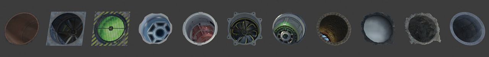
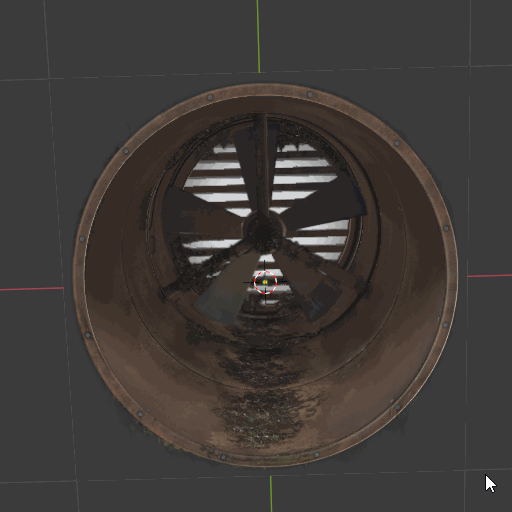
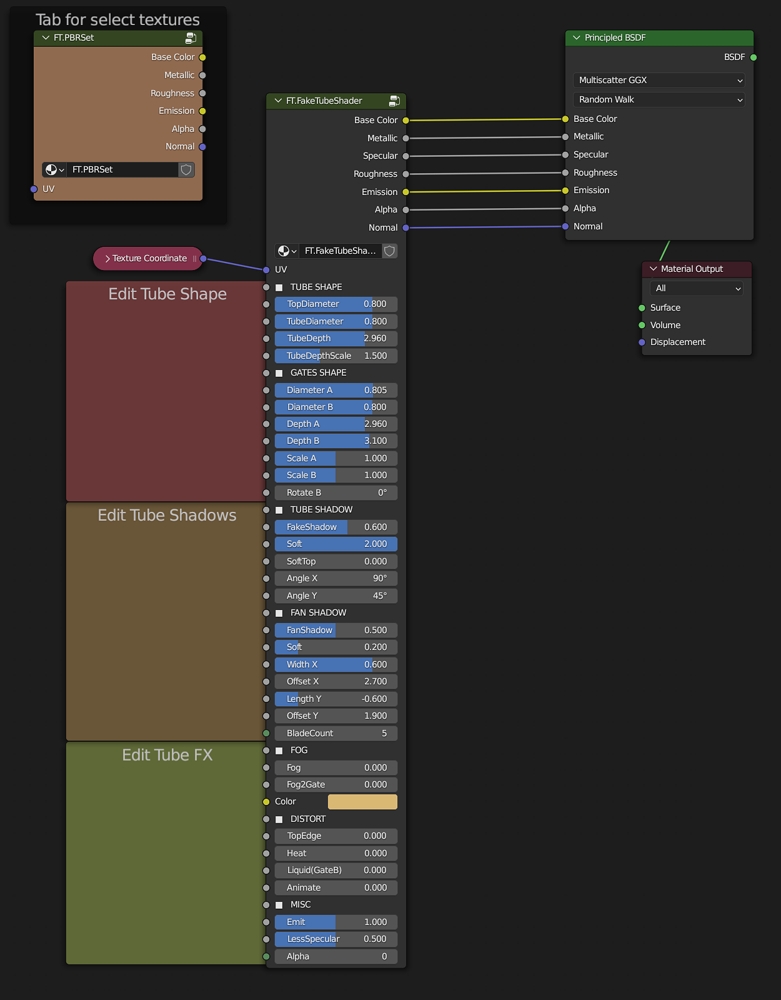
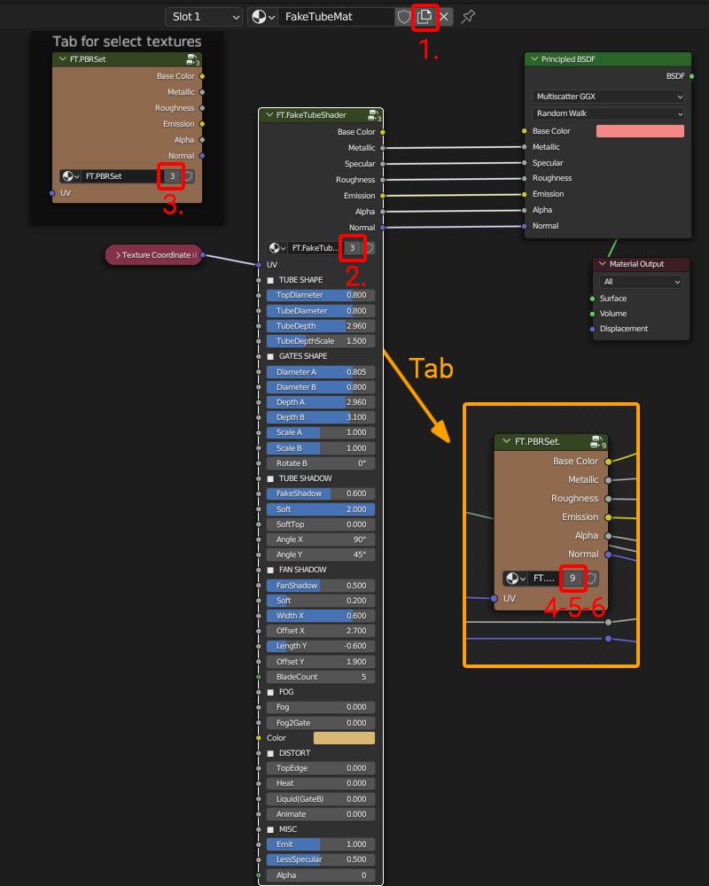

# FakeTube shader guide

Single face FakeTube shader. It can be used as a flat decal snap to walls, floor or any objects to improve scenes details.

Full version: ---

Free example: [FakeTube_free.blend](FakeTube_free.blend) 

---

Shader setting:

  

How it works:

<video src="https://github.com/day9a/Blender/assets/69633736/e3bc3dc9-e9fb-4b5c-b8b7-97f5b19822be" width="256" height="256">

How make new textures:

text

How make material copy:

Hints:

text

Perfomance:

text

