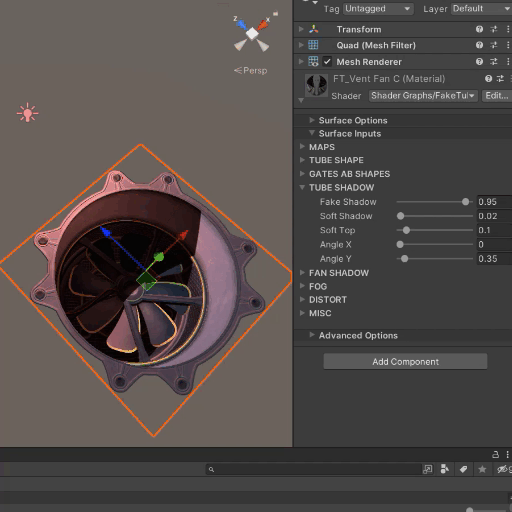

# FakeTube Shader Guide

Single quad FakeTube shader.  
Like a FakeInterior, but it's FakeTube!  
It can be used as a flat decal snap to walls, floor or any objects to improve scenes details.  
  
🔷 ` Full version: ` -  
🔷 ` Blender free example: `  [FakeTube_free.blend](FakeTube_free.blend)  
🔷 ` Unreal free example: ` *coming soon*   
🔷 ` Unity free example: ` [FakeTubeFreeBuiltIn.unitypackage](FakeTubeFreeBuiltIn.unitypackage)  
&emsp; &emsp; &emsp; &emsp; &emsp; &emsp; &emsp; &emsp; &emsp; [FakeTubeFreeURP.unitypackage](FakeTubeFreeURP.unitypackage)  
&emsp; &emsp; &emsp; &emsp; &emsp; &emsp; &emsp; &emsp; &emsp; (unpack to Unity\Projects\YourProjects\Assets) (v2021-2023)  
   

<table>
  <tr>
    <td> 
     
    </td>
    <td>
     
    </td>
    <td>
     <a href="https://www.youtube.com/watch?v=IX7JCYn0P-Q"> 🔹 Youtube Preview 1 🔹 <a>   
     <a href="https://www.youtube.com/watch?v=EOUz8D6mYzk"> 🔹 Youtube Preview 2 🔹 <a>
    </td>
  </tr>
</table>
 

### Details:
- Uses usual PBR textures.  
- All animation handling in-shader.  
- Assumed that quad orientation conform with a standart Unity quad (GameObject > 3DObject > Quad)  
- Works with Unity orthographic camera.  
- ShaderGraph + custom hlsl function for URP/HDRP.  
- Standart Surface Shader for Built-in.  
  
 

- Have more than **30 Properties**, some of which are customizable.  
<table>
  <tr>
    <td> 
      
    </td>
    <td>
      - (!) Shader can't get shadows from outside to inside and uses <b>FakeShadow</b> property that can be adjusted.   
       
      - By default <b>FakeShadow</b> are set from top to bottom.  
       
      - To disable usual shadows (URP): ShaderGraph > Graph Inspector > "Receive Shadows" checkbox and "Cast Shadows" checkbox.  
       
    </td>
   </tr>
   <tr>
    <td> 
      
    </td>
    <td>
     - Use higher values for the <b>Emission Map Power</b> property in <b>HDRP</b> pipeline.  
    </td>
   </tr>
 </table>

 

---

 🔶 Show all properties / How it works:

  
<table>
  <tr>
    <td> 
       
    </td>
    <td>
      FakeTube properties:   
      - highlighted in <b>Red</b> depend on the current texture and is already configured.   
      - highlighted in <b>Green</b> can be adjusted slightly.   
      - highlighted in <b>Blue</b> - shadow can be adjusted depending on the light source in the scene.   
                                                                            
    </td>
  </tr>
  <tr>
    <td> 
      <video src="https://github.com/day9a/Blender/assets/69633736/e3bc3dc9-e9fb-4b5c-b8b7-97f5b19822be" width="256" height="256"> 
    </td>
    <td>
      - Tube separated to 5 parts: Top, Bottom, Walls, Gate A, Gate B where each part of the tube is match each part of the texture.     
      - In general, it looks a UV unwrap.     
      - Parts interact with each other only in a certain way for reasons of perfomance/optimization.     
                                
    </td>
  </tr>
</table>

---

### Perfomance:  
These approximate results may different for each case:
- ~450 math for FakeTube Shader  &nbsp; vs  &nbsp; ~250 math Standart Unity Shader 
- ~300 fps  for FakeTube Shader  &nbsp; &nbsp; &nbsp; vs  &nbsp; ~330 fps in empty scene (both for GTX1070 / fullHD)  
 

