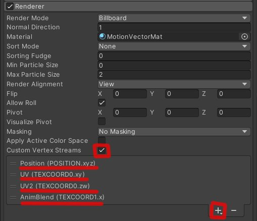

# UnityMotionVectors

Allows to smoothly blend nearest frames on sprite sheets. Works both with and without motion vectors maps.

[https://example.com](https://example.com)

1. Create new material with this shader (Custom/MotionVectorSimple)
2. Use material with particle system.
3. Enable checkbox on Particle System > Rendered > Custom Vertex Stream
4. Add values to list: Position(POSITION.xyz), UV(TEXCOORD0.xy), UV2(TEXCOORD0.zw), AnimBlend(TEXCOORD1.x)

