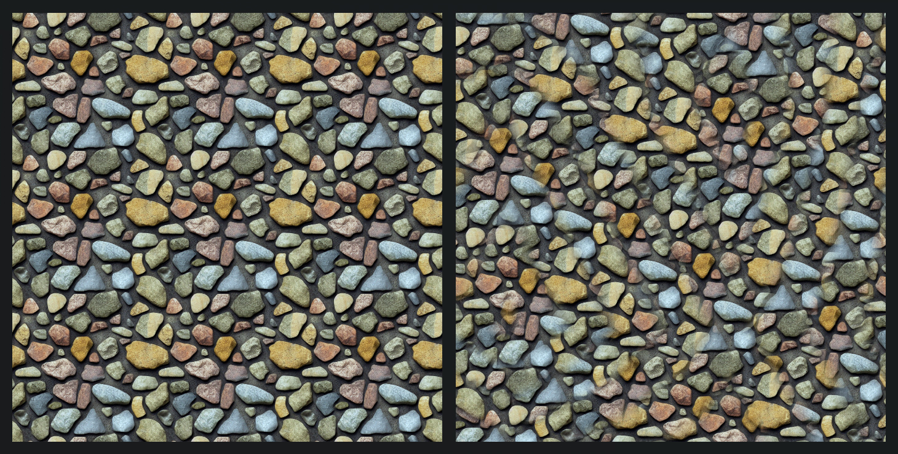
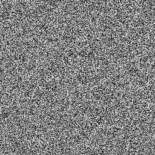

# UnityTextureRandomizer

Cheap way to add randomness to uniform seamless textures. Method number 3 from this [example](https://iquilezles.org/articles/texturerepetition)
This method use only 2 texture samples, but unfrendly with mipmaps.

1. Select seamless texture
2. Use small white noise texture 

